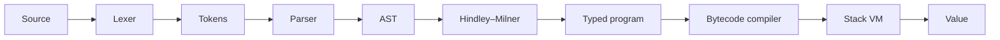

# Lumen

Lumen is a small, eagerly evaluated functional language. A program is a sequence
of function declarations, `let` bindings, and expressions. The implementation is
a conventional compiler pipeline: source is tokenized, parsed into an AST, typed
with Hindley–Milner inference, compiled to a compact bytecode, and executed on a
stack virtual machine.



There is no garbage-collected heap of closures. Functions are named, stored in a
function table, and invoked with `CALL` / `RET`. Recursion is ordinary: `fib`
calls `fib` by name, and each call gets its own frame and local slots.

## Language tour

```text
fn add(x, y) = x + y
fn fib(n) = if n < 2 then n else fib(n - 1) + fib(n - 2)
let n = 10
print(add(n, fib(8)))
```

Literals are integers, booleans (`true` / `false`), and strings. Operators:

| Prec | Forms | Result |
|------|--------|--------|
| 1 | `\|\|` | short-circuit Bool |
| 2 | `&&` | short-circuit Bool |
| 3 | `==` `!=` | Bool, operands must match |
| 4 | `<` `>` `<=` `>=` | Bool over Int |
| 5 | `+` `-` | Int, or `+` on String |
| 6 | `*` `/` | Int (`/` truncates toward zero) |
| 7 | unary `-` | Int |
| 8 | `f(x, y)` | call |

`if cond then a else b` is an expression. The `else` branch is required, and
both branches must have the same type. Parentheses group as expected. `//`
starts a line comment.

```ebnf
program  = { stmt } ;
stmt     = fnDecl | letDecl | expr ;
fnDecl   = "fn" IDENT "(" [ IDENT { "," IDENT } ] ")" "=" expr ;
letDecl  = "let" IDENT "=" expr ;
expr     = orExpr ;
```

Functions are not first-class values. A call’s callee is a name, resolved either
to a user function or to the builtin `print`.

## How inference works

The typer is Algorithm W. Types are

```text
τ ::= α | Int | Bool | String | (τ₁, …, τₙ) → τ
```

Each expression is inferred under a type environment mapping names to *type
schemes* `∀α₁…αₖ. τ`. The important operations:

- **Unify** — two types are made equal by mutating a substitution. A type
  variable may be bound to a type only if it does not *occur* in that type
  (the occurs check), which rejects programs such as `fn omega(x) = x(x)`.
- **Generalize** — after a `fn` or `let` is inferred, every type variable that
  is free in the result but not free in the surrounding environment is
  quantified. That is why `fn id(x) = x` is `∀a. a → a` rather than a single
  monotype.
- **Instantiate** — every use of a name copies its scheme and replaces bound
  variables with fresh ones. `id(1)` and `id(true)` therefore do not interfere.

`+` is slightly ad hoc: the two operands are unified with each other, then the
result must be `Int` or `String`. If it is still a type variable, it defaults to
`Int`, so `fn add(x, y) = x + y` is `(Int, Int) -> Int`. Comparisons other than
`==` / `!=` are `Int`-only.

`print` is a prelude binding `∀a. a → a`: it writes its argument and returns it.

## How the VM works

The compiler walks the typed AST and emits a linear instruction stream. Each
`fn` becomes a `FuncChunk` `{ name, arity, code }`. Top-level `let` and
expression statements become the `main` chunk.

| Opcode | Effect |
|--------|--------|
| `CONST` | push a literal |
| `LOAD` / `STORE` | local slot or global name |
| `ADD` `SUB` `MUL` `DIV` | arithmetic; `ADD` also concatenates strings |
| `EQ` `NE` `LT` `GT` `LE` `GE` | comparisons |
| `JUMP` / `JUMP_IF_FALSE` | control flow for `if`, `&&`, `\|\|` |
| `CALL` | pop arguments, push a frame, jump to the named chunk |
| `RET` | pop a frame, push the return value |
| `PRINT` | write the top of stack |
| `POP` | discard a value |

`if n < 2 then n else …` compiles to `LOAD n; CONST 2; LT; JUMP_IF_FALSE else;
LOAD n; JUMP end; else: …; end:`.

A call `fib(n - 1)` compiles to `LOAD n; CONST 1; SUB; CALL fib 1`. The VM pops
the argument into the new frame’s local `0`, runs that chunk until `RET`, and
leaves the result on the shared operand stack. Nested and recursive calls are
the same mechanism; stack frames hold instruction pointers and locals, not
closures.

## Examples

Fibonacci (`examples/fib.lu`):

```text
fn fib(n) = if n < 2 then n else fib(n - 1) + fib(n - 2)
fib(10)
```

evaluates to `55`.

Polymorphism (`examples/poly.lu`):

```text
fn id(x) = x
let n = id(1)
let flag = id(true)
let label = id("lumen")
```

All three uses type-check. The scheme for `id` is instantiated independently at
`Int`, `Bool`, and `String`.

## Running

```bash
npm install
npm test
npm run build
npm start                 # REPL
npx tsx src/cli.ts examples/fib.lu
```

After `npm run build`, the `lumen` binary is `dist/cli.js`.

The REPL prompt is `lumen> `. Definitions accumulate for the session.

```text
lumen> fn add(x, y) = x + y
add : (Int, Int) -> Int
lumen> add(2, 3)
5
lumen> :type add(1, 2)
Int
lumen> :quit
```

Type errors raise `TypeError` with a location. Parse errors raise `SyntaxError`
with `line:col`.

## Layout

```text
src/ast.ts        expressions and statements
src/lexer.ts      scanner
src/parser.ts     Pratt / recursive-descent parser
src/infer.ts      Hindley–Milner (unify, generalize, instantiate)
src/compiler.ts   AST → bytecode
src/vm.ts         stack machine
src/value.ts      runtime values
src/index.ts      tokenize, parse, infer, compile, run, evaluate
src/cli.ts        REPL and file runner
```

`evaluate(source)` returns `{ value, type }` after the full pipeline. That is
the entry used by the tests and the CLI.
